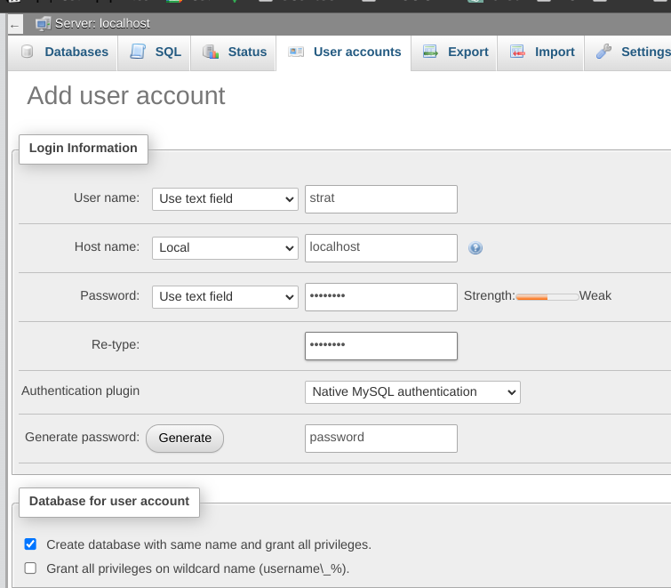

# ss_weather

List input variables

List output variables

## Strategy Database Transactions

### Creating a Database

To interact with the database, we use a library called SQLAlchemy. Create a new database for the strategy team in XAMPP or whatever you are using. Here is an example for how to create a new user and a database with the same name.



Make sure to copy file `db/env.example` and rename the file to `db/.env` so that your password is not in version control. Then exchange the dummy values in `db/.env` to the values you previously chose

### Adding entries

You can create new entries to the database by executing the following code:

```py
# current file: any in root level directory
from db.db_service import DbService
from db.models import *

# your API response in JSON / python dict
api_data: dict = {"gk": 83.3, "gh_max": 110.63228810314124, "tt": 26.5, "ff": 11}

forecast: Forecast = Forecast(
    api_data["gk"], api_data["gh_max"], api_data["tt"], api_data["ff"]
)

db: DbService = DbService()
db.add_entry(forecast)
```